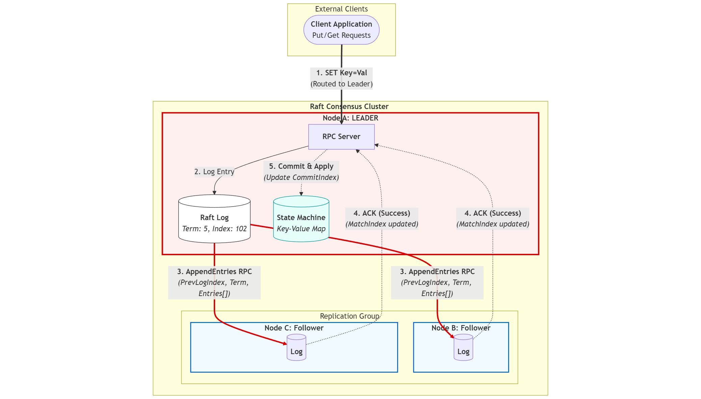
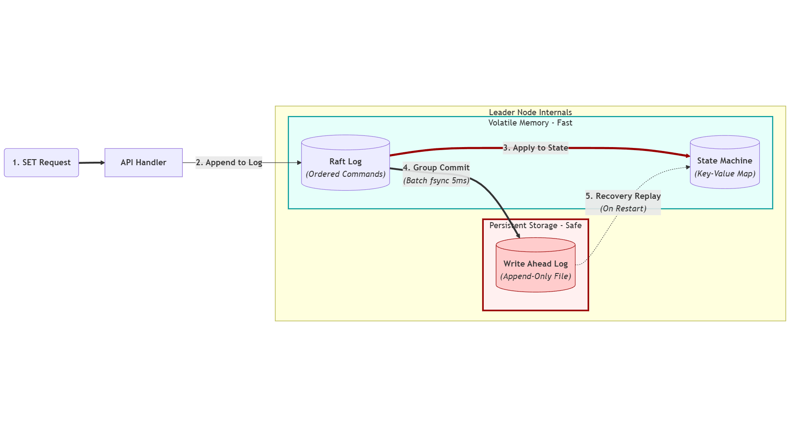
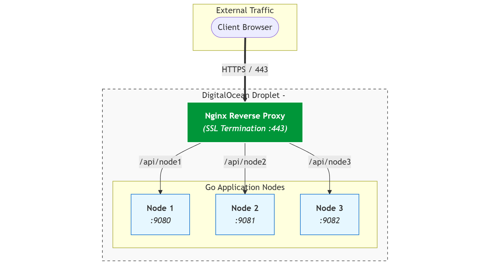

# Distributed Key-Value Store: Design and Architecture

> A High-Performance database that never loses data, even if a server crashes. It uses `Raft Consensus` to duplicate data across multiple servers and `Write-Ahead Logging` to save data to disk efficiently. 

---
## 1. How it Works ( Architecture )
Most databases live on a single server. Thus, if that server dies the website goes down.
**The Solution:** I run a cluster of **3 servers**. They exchange to agree on every piece of data.

### LifeCycle of a "Write" Request.
1. **The Leader:** One node is elected as the Leader. All writes (`SET key value`) must go to it.
2. **Replication:** The Leader sends the data to the Followers.
3. **Consensus:** The Leader has to wait for a majority vote (2/3 nodes here) to continue.
4. **Confirmation:** Only then does the Leader send "Success" to the client-side.
   * *Result:* : Even if the Leader crashes right after, the data stays consistent on the Followers.

---

## 2. How Data Is Kept Safe
Writing on the Hard-Drive is slow. Writing to Memory is fast but vanishes if power is lost.

  
<b>Speed & Latency Comparison</b>

| Feature | RAM (Memory) | SSD (Solid State Drive) | HDD (Hard Disk Drive) |
| :--- | :--- | :--- | :--- |
| **Average Latency** | ~10–100 nanoseconds | ~50–150 microseconds | ~5–10 milliseconds |
| **Max Transfer Rate** | ~25–100+ GB/s | ~500 MB/s – 7.5 GB/s | ~80–200 MB/s |
| **Access Time Ratio** | 1x (Baseline) | ~1,000x slower | ~100,000x slower |

**The Solution:** I combined them using a Group commit strategy.

### The Group Commit Optimization
Instead of writing to the hard drive for *every single user* (which is slow), I used a smart buffer system:
1.  **Batching:** I let requests pile up in memory for a tiny window (5 milliseconds).
2.  **Flush:** I write the whole pile to the hard drive (Disk) in one big chunk.
3.  **Speed:** This allows us to handle **13,900 writes per second** while still guaranteeing data safety.

### Crash Recovery
* **The Scenario:** A power outage kills the server. RAM is wiped clean.
* **The Fix:** On restart, the server reads the **Write-Ahead Log (WAL)** from the disk. It "replays" every single command that ever happened, perfectly reconstructing the memory state.

---

## 3. Safety Rules (The Math Behind It)
I followed the strict **Raft Safety Properties** to ensure the database is never wrong.

| Rule | What it means in plain English |
| :--- | :--- |
| **No Split Brains** | There can never be two Leaders at the same time. |
| **No Lost Data** | Once we tell a user "Saved," that data will survive even if servers crash. |
| **Total Order** | Every server applies updates in the exact same order. |

---

## 4. Performance Stats
* **Speed:** ~13,900 writes/second.
* **Latency:** 99% of requests finish in under 26ms.
* **Capacity:** Tested consistently with 2+ million records.

---
## 5. Deployment Architecture

* **Cloud Provider:** DigitalOcean (Basic Droplet, 1GB RAM).
* **Reverse Proxy:** Nginx (Handles SSL termination & routing).
* **Process Manager:** Systemd (Ensures nodes restart if they crash).

---
*Resources:* https://raft.github.io/raft.pdf

