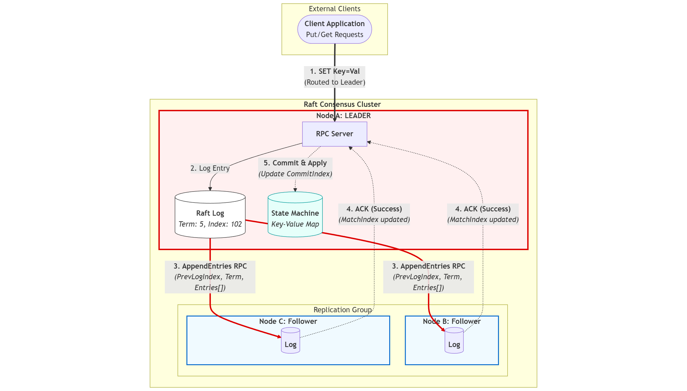
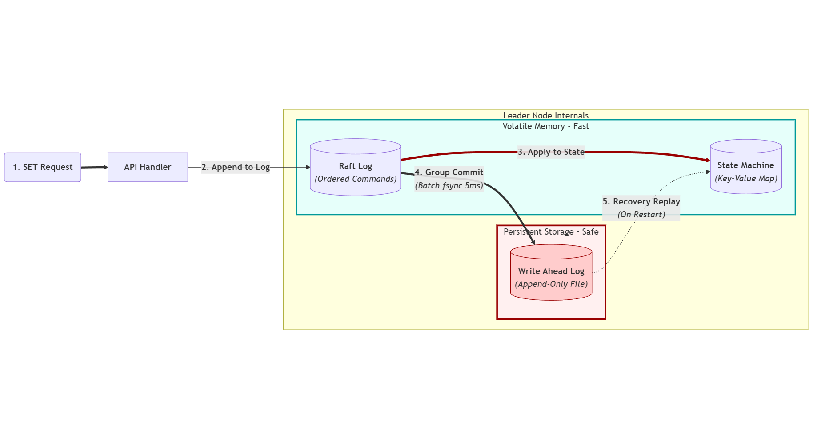
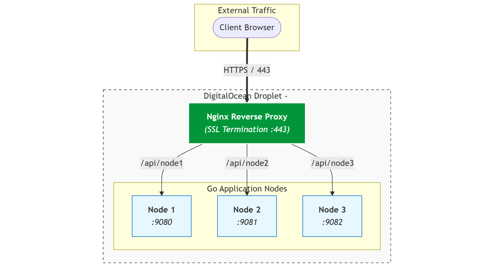

# KV-Store — A Distributed Key-Value Store in Go

A fault-tolerant, in-memory key-value database that survives crashes and server failures. Data is replicated across a 3-node cluster using the **Raft consensus algorithm**, and persisted to disk with a **Write-Ahead Log (WAL)** using a group-commit strategy.



## Features

- `SET key value` / `GET key` over a plain TCP protocol
- Leader election and log replication (Raft)
- Durable writes via a Write-Ahead Log with group commit
- Full crash recovery by replaying the WAL on startup
- Node pause/resume to simulate failures
- HTTP endpoint per node (TCP port + 1000) exposing metrics and cluster state

## Architecture

The project is split into four packages:

| Package | Responsibility |
| :--- | :--- |
| `internal/store` | In-memory `map[string]string` guarded by a `sync.RWMutex`. Every `Set` goes through the WAL first, then updates memory. |
| `internal/wal` | Append-only log on disk. Batches writes and fsyncs them in groups (see below). `Recover()` replays the log into a map on startup. |
| `internal/raft` | Consensus: leader election, heartbeats, and incremental log replication over raw TCP. |
| `internal/server` | TCP server that parses the wire protocol (`SET`, `GET`, `VOTEREQUEST`, `APPENDENTRIES`, ...) and glues the store and Raft together. |

### Lifecycle of a write

1. The client sends `SET key value` to a node. If that node is not the leader it replies `NOTLEADER` and the client must retry against the leader.
2. The leader appends the command to its Raft log and broadcasts it to the followers via `APPENDENTRIES`.
3. Followers append the entries, apply them to their own store, and reply `SUCCESS`.
4. The leader writes the entry through the WAL (durably on disk) and to its in-memory map, then replies `OK`.

### Consensus (Raft)

Each node runs a state machine cycling between **Follower**, **Candidate**, and **Leader**:

- Followers wait for heartbeats with a randomized 500–1000&nbsp;ms election timeout. The randomization prevents all nodes from starting elections at the same instant.
- A candidate increments its term, votes for itself, and requests votes from peers. It becomes leader on a majority quorum (2 of 3), or falls back to follower on timeout.
- The leader sends heartbeats every 100&nbsp;ms. Heartbeats double as replication: the leader tracks `nextIndex`/`matchIndex` per follower and piggybacks only the entries each follower is missing. On a `CONFLICT` reply it decrements `nextIndex` and retries, walking back until the logs match.

This gives the standard Raft safety properties: at most one leader per term (no split brain), no acknowledged write is ever lost while a majority survives, and all nodes apply commands in the same order.

### Durability: WAL with group commit

Calling `fsync` on every single write is the honest way to guarantee durability, but it is brutally slow (one disk sync per request). The fix is **group commit**:

1. Incoming writes are queued in an in-memory pending buffer; each caller blocks on a channel.
2. A background goroutine flushes the buffer every **5&nbsp;ms**: all queued entries are written to the file, followed by **one** `fsync` for the whole batch.
3. Every waiting caller is then unblocked with the flush result.

Each write still waits for its data to physically hit the disk before the client sees `OK` — the cost of the sync is just amortized across the batch. This took throughput to roughly **13,900 writes/sec** with p99 latency under 26&nbsp;ms (tested with 2M+ records).



### Crash recovery

On startup each node replays its WAL (`server_<port>.log`) line by line, rebuilding the in-memory map exactly as it was before the crash. Since the WAL is written before memory is updated, a crash can never lose an acknowledged write.

## Running a cluster

```bash
go run ./cmd/server -port 8080 -peers ":8081,:8082"
go run ./cmd/server -port 8081 -peers ":8080,:8082"
go run ./cmd/server -port 8082 -peers ":8080,:8081"
```

Talk to it with any TCP client:

```bash
# e.g. with netcat
nc localhost 8080
SET name mathdee
OK
GET name
mathdee
```

Each node also serves HTTP on `port + 1000` (e.g. 9080) for metrics and cluster status, which the dashboard in `kv-dashboard/` consumes.

## Issues Encountered and How They Were Solved

**1. Per-write fsync was a throughput killer.**
The first WAL implementation synced the file on every `Set`, which capped the store at a few hundred writes per second. Solved by the group-commit design above: batch for 5&nbsp;ms, one fsync per batch, callers block on a per-write channel until their batch is durable.

**2. Election storms / split votes.**
With fixed election timeouts, all followers timed out simultaneously, everyone became a candidate, and votes split forever. Solved with randomized timeouts (500–1000&nbsp;ms) and a hard candidate timeout that drops the node back to follower if no majority is reached.

**3. Replication originally resent the entire log.**
Early heartbeats shipped the full log to every follower on every tick, which fell apart past a few thousand entries. Solved by implementing proper incremental replication: per-peer `nextIndex`/`matchIndex` tracking so heartbeats only carry the entries a follower is missing, plus `CONFLICT` back-off to repair diverged logs.

**4. Writes accepted by followers caused inconsistency.**
If any node accepted a `SET`, replicas diverged. Solved by rejecting writes on non-leaders with a `NOTLEADER` response, forcing all writes through the single elected leader.

**5. Followers appended entries but never applied them.**
Replicated entries sat in the Raft log without updating the follower's store, so `GET` on a follower returned stale data. Solved with `GetUnappliedEntries()`: after a successful `APPENDENTRIES`, the follower applies every not-yet-applied `SET` to its store.

**6. Testing failure scenarios.**
Killing real processes made demos painful. Added `Pause()`/`Resume()` on the consensus layer so a node can simulate a crash (ignores heartbeats, stops participating) and later rejoin as a follower and catch up via replication.

## Known Limitations

This project was built to learn how distributed databases work, so I kept some parts simpler than a full Raft implementation. Here's where it differs from the real thing:

- **Raft state is not saved to disk.** The current term, who a node voted for, and the Raft log only live in memory. Real Raft requires saving these to disk so a node that restarts doesn't accidentally vote twice in the same term or forget its log.

- **The leader doesn't wait for a majority before saying "OK".** When a write comes in, the leader saves it locally and sends it to the followers in the background, then immediately replies to the client. Proper Raft waits until a majority of nodes have confirmed the entry before telling the client it succeeded. In rare cases (leader crashes right after replying), a confirmed write could be lost.

- **Elections don't check how up-to-date a candidate's log is.** A node grants its vote to whoever asks first in a new term. Real Raft only votes for candidates whose log is at least as complete as its own — without this check, a node that missed some writes could become leader and overwrite them.

- **Followers trust the leader's log blindly.** The log-matching check (comparing terms at the previous index) is simplified, so a diverged follower could end up with a slightly different history in edge cases.

- **The WAL format is basic.** Entries are stored as plain `key,value` lines, so a value containing a comma would break recovery. There are also no checksums, so a half-written line from a crash mid-write isn't detected — it's just skipped.

- **No log compaction or snapshots.** The Raft log and WAL grow forever. A long-running node would eventually take a long time to replay its log on restart.

I know that these are the natural next steps for this project.

## Performance

- ~13,900 writes/second sustained
- p99 latency < 26 ms
- Tested with 2+ million records

## Deployment

Deployed on a DigitalOcean droplet (1&nbsp;GB RAM) with Nginx as reverse proxy/SSL termination and systemd keeping the nodes alive.



## Resources

- [The Raft paper](https://raft.github.io/raft.pdf)
- `Design.md` in this repo for a deeper design walkthrough
